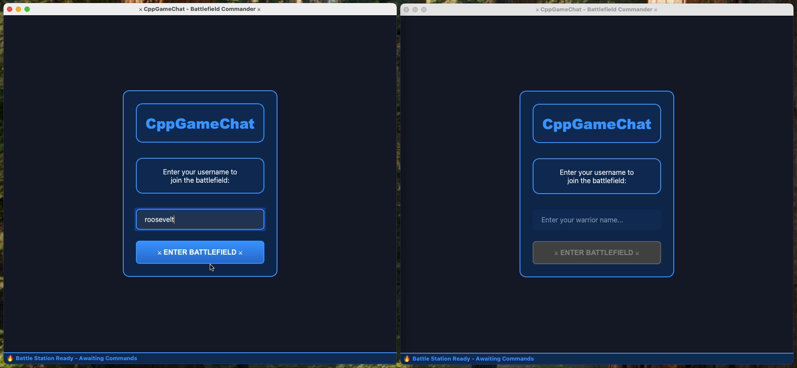
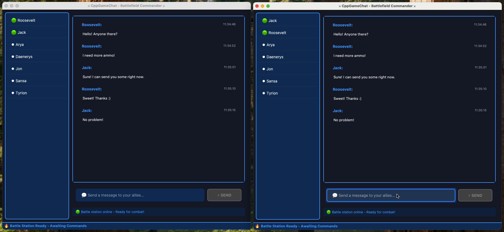

# CppGameChat

A modular, production-style C++/Qt5 desktop chat application demonstrating real-time friends, chat, and rich presence using Google Cloud Firestore for storage.

## Demo Video

https://github.com/user-attachments/assets/e15c86c4-483b-446a-ac43-b04c6f36d773

## Screenshots





## Features

- **Clean Qt5 Widgets UI**: Login screen -> Chat interface with friends list
- **Real-time Chat**: Global chat room with live message updates via polling
- **Friends & Presence**: Static friend list with online/offline status indicators
- **Firestore Integration**: Uses Firestore REST API (no Firebase Auth required)
- **Modular Architecture**: Clean separation with services, models, and UI layers

## Prerequisites

- **Qt5**: Qt5 with Widgets and Network modules
- **CMake**: Version 3.16 or later
- **C++17**: Compatible compiler
- **GoogleTest**: For running unit tests (optional)
- **Google Cloud Firestore**: Project with API key

## Building

1. **Install CMake**:
   ```bash
   # macOS with Homebrew
   brew install cmake
   
   # Ubuntu/Debian
   sudo apt-get install cmake
   
   # CentOS/RHEL/Fedora
   sudo dnf install cmake
   # or: sudo yum install cmake
   
   # Windows
   # Download from https://cmake.org/download/
   # Or via Chocolatey: choco install cmake
   # Or via Scoop: scoop install cmake
   ```

2. **Install Qt5**:
   ```bash
   # macOS with Homebrew
   brew install qt@5
   
   # Ubuntu/Debian
   sudo apt-get install qtbase5-dev qtbase5-dev-tools libqt5network5-dev
   
   # Windows
   # Download Qt5 from https://www.qt.io/download
   ```

3. **Clone and build**:
   ```bash
   git clone <repository-url>
   cd CppGameChat
   mkdir build && cd build
   cmake ..
   make
   ```

4. **Create configuration file** in the build directory (config.json):
   ```json
   {
     "apiKey": "your-firestore-api-key",
     "projectId": "your-firestore-project-id",
     "databaseId": "(default)",
     "pollIntervalMs": 1200,
     "presenceHeartbeatMs": 5000,
     "presenceStaleMs": 12000
   }
   ```

5. **Run the application**:
   ```bash
   ./app/QtChatPresence
   ```

## Firestore Setup

### Using Firestore Emulator (Recommended for Development)

1. **Install Firebase Tools**:
   ```bash
   npm install -g firebase-tools
   ```

2. **Start emulator**:
   ```bash
   firebase emulators:start --only firestore
   ```

3. **Update config.json** to point to emulator:
   - Use project ID: `demo-project`
   - The emulator runs on `localhost:8080` by default

### Using Cloud Firestore

1. Create a Firebase project at https://console.firebase.google.com
2. Enable Firestore Database
3. Get your API key from Project Settings (Web)
4. Use permissive rules for demo.

## Data Structure

The application uses these Firestore collections:

- `presence/{userId}`: User online/offline status and heartbeats
- `rooms/global/messages/{messageId}`: Chat messages in the global room

## Testing

Run unit tests with GoogleTest:

```bash
cd build
make
./tests/core_tests/core_tests
```

Tests cover:
- Presence calculation logic
- Retry policy with exponential backoff
- Firestore JSON mapping and parsing

## Friend List

The app includes 5 demo friends:
- Jon
- Arya  
- Tyrion
- Daenerys
- Sansa

Their online/offline status is determined by looking up their presence in Firestore.

## Troubleshooting

**Build Issues**:
- Make sure Qt5 is in your PATH
- Check CMake can find Qt5: `cmake .. -DQt5_DIR=/path/to/qt5`

**Connection Issues**:
- Verify your config.json has valid apiKey and projectId
- Check Firestore security rules allow read/write
- For emulator: ensure it's running on localhost:8080

**No Messages Appearing**:
- Verify your API key has Firestore permissions
- Try sending a message through Firestore console directly
